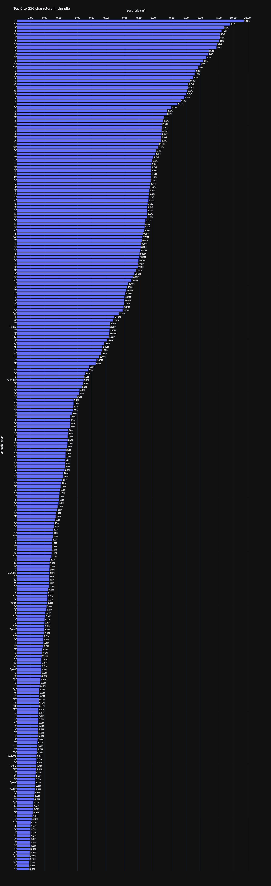

# Pile-Char-Counts
counts unique unicode chars within the pile dataset (specifically https://huggingface.co/datasets/EleutherAI/raw_deduplicated_pile)

Turns out the difference between counting chars in a 10k char dataset is very different from trying to do that with a 800 billion char dataset. Who knew?

This repo includes both the code to download/load the dataset via huggingface, as well as the code that maps a function on it in batches that counts up the unique unicode chars. Note that the processing can be memory and hdd space intense at large batch sizes.
So, if you don't want to spend an afternoon downloading and processing anything, I also include the final aggregated counts as an npy file, which is loaded by default by the included notebook for visualization.

Ideally a few tweaks to the processing code could yield other sorts of statistics that someone might need or want on such a dataset, but for now, here's a simple plot from the notebook:

